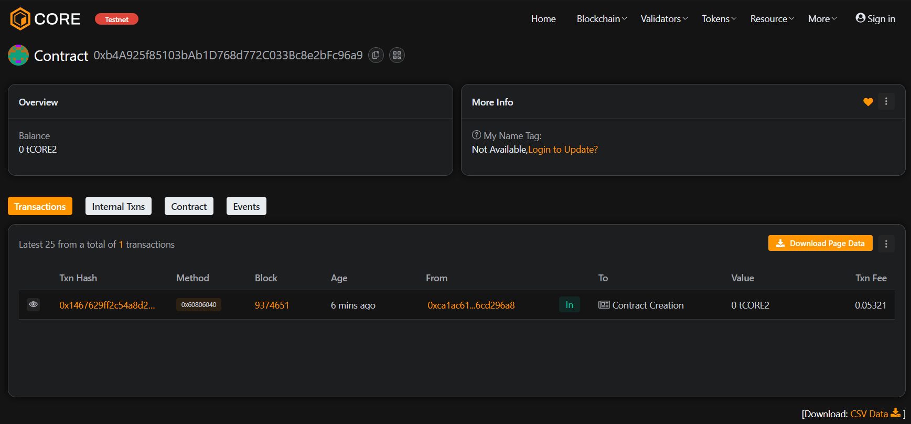

# MetaRoot

## Project Description
MetaRoot is a decentralized identity anchoring protocol designed to link multiple wallet addresses, on-chain profiles, and authorization credentials to a single verifiable root identity. It serves as an identity foundation layer across multiple blockchain ecosystems.

## Project Vision
To become the universal identity layer for Web3, allowing users to maintain a portable, secure, and privacy-preserving identity across decentralized applications and chains.

## Key Features
- **Unified Identity:** Consolidate multiple wallets under one root identity.
- **Zero-Knowledge Privacy:** Authenticate without revealing sensitive account data.
- **Cross-Chain Compatibility:** Works across EVM and non-EVM networks.
- **Reputation Profiles:** Build a transferable, persistent on-chain reputation score.

## Future Scope
- Integration with decentralized social platforms.
- NFT profile-based identity abstraction.
- DID standardization and enterprise login adoption.

### Contract address:
0xb4A925f85103bAb1D768d772C033Bc8e2bFc96a9
